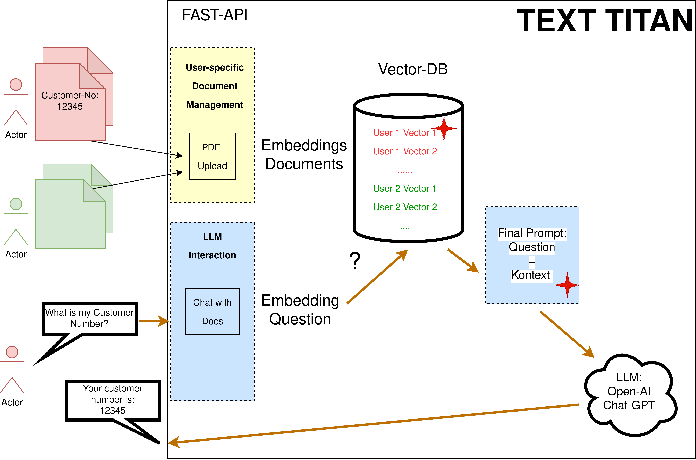

## TextTitan
Codecamp 2023 - Hannah, Leon, Patrick

---

## What is a LLM?
- llm = large language model
- is like a smart program that predicts what words come next
- it is based on a model trained on a large set of texts in one or more languages
- it can translate, summarize and generate texts
- famous examples: Meta Llama2, OpenAI ChatGPT 

---

---

## What is TextTitan
- can ingest PDFs for a given user
- can search on the user specific documents using a vector DB for similarity search
- asks ChatGTP for an answer given a question and the context from the similarity search

---

## Examples
- chat with documents
  - ask your personal documents some questions
  - advanced search taking document metadata into account
- metadata tagger
  - generate metadata from an predefined structure
- chat with [chinook](https://www.sqlitetutorial.net/wp-content/uploads/2018/03/sqlite-sample-database-diagram-color.pdf)
  - ask your test DB some questions

---

## Conclusions:
- prompt engineering is crucial
- local llama2/gpt4all models without GPU are slow compared to ChatGPT in the cloud
- the gpt-4 model is noticeably better than gpt-3.5-turbo on slightly complex tasks
- langchain allows a lot of flexibility to assemble complex answering chains
- https://github.com/baloise-incubator/privatellm
